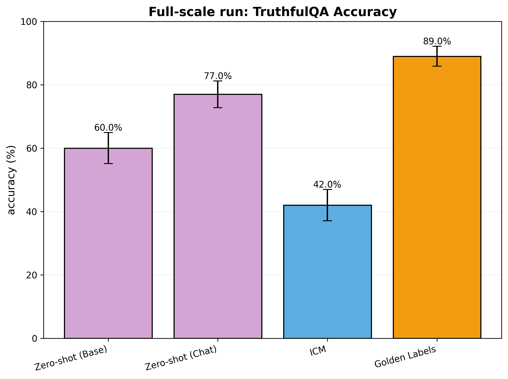

# Background

This repo is to accompany Feng and Ududec Work Test for MATS 9.0, see instructions on [this google doc](https://docs.google.com/document/d/1Qur8Y78Q0PVExkmH8dhjOinWZk1gO9lj4c-_nKunp14/edit?tab=t.0)

Core mission: reproduce a version of Figure 1 from the Unsupervised Elicitation paper using:
- TruthfulQA only
- Prompt-only experiments
- Llama-3.1-405B (base) and Llama-3.1-405B-Instruct (chat)


# Final plot


**Key differences to paper**
- Different hypers
- Error bars here are std-dev of binary correctness, rather than comparisons between different ICM runs (the ICM runs took ~2 hours to run, even with asyncio so didn't want to repeat!)

**Note:** the plot clearly looks wrong! I would love to dig into this further. 

Possible causes:
- bad hypers
- lack of consistency penalty
- code bug
- ?

Quick follow-up: Cursor-Claude-scripted analysis script showed that on the train set the ICM labels had:
```
Metadata: 500 iterations, final temp: 0.4231

============================================================
ICM Run Analysis
============================================================
Number of labeled questions:    219
Number of unlabeled questions:    0
Total examples:                 219

Accuracy (vs gold labels):     0.4475 (44.75%)
Correct predictions:             98 / 219
============================================================
```
Conclusion: the ICM process didn't converge to ground-truth labels (there likely wasn't an error with my test-set-evaluation code).

To debug this further I would implement various logs during the ICM process (at least accuracy, but probably also a notion of distance from starting state, acceptance, potential etc). Ideally also checkpoint the successive labelsets (only small hard-disk-space required).

# Using the repo
## Setup
This project uses `uv`.
Follow standard `uv` setup.

## Entrypoint
The entrypoint to this codebase is in `src/cli.py`. This can run in three modes:
1. `run` - ICM search on train set
2. `evaluate` - Run all 4 evaluations
3. `visualize` - Generate bar chart

## Shell scripts
All commands are intended to be run from the project root. Commands are stored in the `experiments` directory in subdirectories of name `exp_name` that describes the purpose of the experiment.

FINAL RUN COMMANDS can be found in `experiments/4_full_scale/cmds.sh`.


# ! Implementation Notes and Modification !

## Modification
Note: I made one small modifications to the algorithm to save computational work:
- Where: In `src/core.py` lines 283-331 (_calculate_score method)
- What: When N > max_n_loo (20), randomly sample indices for leave-one-out calculation
- Why: Computational efficiency for large datasets

## Searcher hyperparameters
I take most Searcher hyperparameters from `codelion`'s [searcher implementation](https://github.com/codelion/icm/blob/c7c3897345c43e821dd259f5f926489cb11d1307/icm/core.py#L42)

In `experiments/4_full_scale/cmds.sh`, I override to use `max_iterations=500` to save time.

## Generation hyperparameters
I don't think the paper mentioned explicitly whether in the evaluations the responses where sampled or picked greedily, and if sampled at what temperature.
For now I used
- Base model evaluations: sampling from softmax(logprobs) instead of argmax (argmax=False)
- Chat model: temperature=0.7

## Graceful failures
I typically want code to error out when there is a problem rather than 'failing gracefully' as LLMs seem to love. However, I got certain tricky API behaviour that required some grace...
- For chat model evaluations, I would often get empty-content responses. I have some logic to retry up to a max-tries and then just give up.
- For base model log-probs, sometimes True/False would not both be in the top-logprobs. In this case I set the label not in top to logprob of `-np.inf`.

Search 'gracefully' in the codebase to see where this logic is. I also tried to mark these with `NOTE` or `TODO` comments.

# Final note
Thanks for reading!